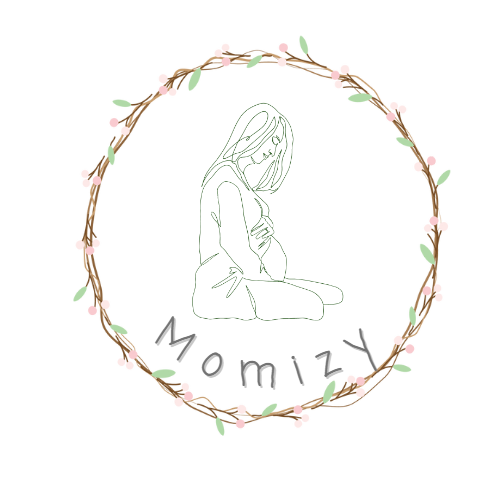

# readmi

# Momizy

[See the App](https://momizy-app.netlify.app/)

### Descripción

Esta página web está enfocada en las mujeres embarazadas, para que todas ellas tengan un lugar sencillo de utilizar para poder organizar la llegada del más pequeño de la casa.

### Tecnologías utilizadas

- HTML
- CSS
- JavaScript
- React
- Axios
- React Context
- React Router
- MUI

## Estructura del cliente

- 404 - Una página para saber como usuario que has hecho algo mal tu, no el servidor.
- 500 - Una página para saber que el error no es tuyo como usuario, sino que es algo que ha fallado internamente.
- Home - Esta página tiene un pequeño resumen de lo que es la página y solo puedes registrarte o hacer login.
- Signup - para registrarse en la web.
- Login - Si ya tienes una cuenta creada o acabas de crearla tendrás que hacer login para acceder a la web.
- Profile- donde puedes ponerte una foto de perfil y además escribir de cuantas semanas estás y el nombre del bebé.
- Preguntas y Respuestas - Sitio donde puedes ver las preguntas y respuestas que han hecho otras embarazadas de la plataforma.
- AñadirPregunta y AñadirRespuesta - Ambas son para formular, una para preguntas y otra para respuestas.
- Diario - Donde puedes ver tus diferentes entradas de diario en lista.
- NewDiario - Escribes una nueva entrada de diario y al guardarla se añade a la página anterior.
- Listas - Donde tienes las listas que has creado.
- NewList - Para crear una nueva lista con los items que quieras.
- DatosLista - En cada lista puedes ver el titulo y añadir items si lo quieres

### Rutas de Cliente

| Path | Page | Components | Permissions | Behavior |
| --- | --- | --- | --- | --- |
| / | Home |  | public | Página de Home |
| /signup | Signup |  | public | Para registrarte en la página |
| /login | Login |  | public | Para hacer login en la página |
| /profile | Profile | DatosEmbarazo, ImageUploader | user only | Donde tienes tu página de Perfil |
| /signout | Signout |  | user only | Para cerrar sesion |
| /preguntas | Preguntas |  | user only | Donde salen todas las preguntas |
| /preguntas/:id | Respuestas |  | user only | Cuando te metes en una sola pregunta |
| /preguntas/newQuestion | AñadirPregunta |  | user only | Para añadir una nueva pregunta |
| /preguntas/:id/newAnswer | AñadirRespuesta |  | user only | Para añadir una respuesta |
| /diario | Diario |  | user only | Donde ves todas las entradas de tu diario |
| /diario/:id | DatosDiario |  | user only | Cuando te metes en una entrada |
| /diario/newDiario | NewDiario |  | user only | Para crear una nueva entrada de diario |
| /listas | Listas |  | user only | Donde ves todas tus listas |
| /lista/:id | DatosLista | NewListItem | user only | Cuando te metes en una lista  |
| /lista/newList | NewList | NewListItem | user only | Para crear una nueva lista |
| /error | Error | Navbar |  | error |
| * | NotFound |  |  | NotFound |

### Otros componentes

- Navbar

### Context

- auth.context

### Project

[Link del repositorio del Cliente](https://github.com/Proyecto-final-Ironhack-Lorena/app-client)

[Link del repositorio del Server](https://github.com/Proyecto-final-Ironhack-Lorena/app-server)

[Link del Deploy](https://momizy-app.netlify.app/)

### Slides

[Link a los Slides](https://www.canva.com/design/DAFlUuGxEyo/4QYe3ho-XVWaPPU9lNO33w/view?utm_content=DAFlUuGxEyo&utm_campaign=designshare&utm_medium=link&utm_source=publishsharelink)